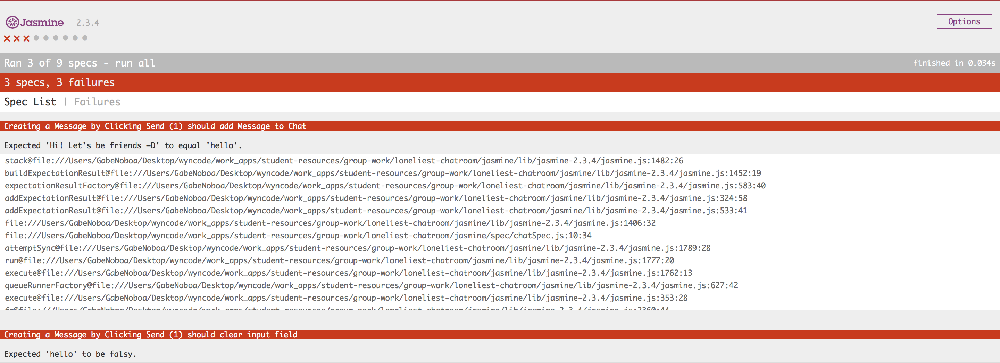

# The Loneliest Chatroom

Have you ever talked to yourself? Good! For this hackathon you're going to be building an app that lets you talk to yourself all day! This is... The Loneliest Chatroom!

During this exercise, you'll write JavaScript to make our chatroom-for-one work. To do so, we've provided you with failing tests written in Jasmine, a JS testing framework, which you will need to make pass. Each passing test will earn you points, and the team with the most points at the end of two hours wins.

Upon completion, you should be able to manipulate the DOM using common JavaScript and jQuery functions and use AJAX to retrieve data from a public API.

## Getting Started

Fork this repository, then clone it to your desktop so you can work on your local environment.

Open `index.html` in your browser. This is the app you'll be building. Notice that we have provided you with the HTML and CSS, but nothing works yet.

In `index.html` uncomment lines 13-19 and refresh the browser. You should now see Jasmine appear on bottom of the page, with 6 specs that are pending.

Let's get your tests set up. Open `jasmine/spec/chatSpec.js`, these are the specs we wrote for you.

Jasmine makes it quick and easy to disable tests by adding 'x' before each `describe` or `it` block. Specs in `xdescribe` and `xit` blocks don't run.

When you're ready to begin working on a feature, simply remove the `x` to make those tests start running, and start making them pass!

### Jasmine

Jasmine is a unique test framework in that it runs in your browser, right under your content! We used jQuery to fill in content, trigger 'click' and 'keypress' events, and verify that the expected behaviour occurs.

If you read through the specs, you'll see that the syntax is nearly identical to the RSpec syntax you've been using all along. By just reading jQuery and the familiar RSpec syntax, you should be able to tell what's going on. Use the tests to help you write your code!

### Score Guide
Below is a list of each feature and the points your team earns for implementing it. With the exception of the first one, they DO NOT have to be completed in order. Figure out how to best use your team to earn the most points by the end of the Hackathon.

Feature | Points
---|---
Create Message | 1
Delete Message | 1
Create Message w/ Enter | 2
Timestamps | 2
Me/Myself/I | 3
API Response | 5

#### Create Message
Simple, typing in the text box and clicking send should post a message to the chat! Each chat is just a `<li>` in an `<ol>`. We've included a standard chat already there to use as a template. This feature needs to be added in order for any of the others to work.

_Tip:_ Break this up into tiny chunks. First, `console.log` something whenever someone clicks the button, just to confirm you've got that working. Then, `console.log` the contents of the input field, to confirm we are reading that correctly. Finally, work on appending a new message to the conversation. Treat the existing message as a template. Remember from homework, all HTML is just a string. Build that string, interpolate the new message, and append it.

#### Delete Message
This one seems simple on the surface, but there's more to it than meets the eye! When I click the "x" in the top right-hand corner of a chat, it should delete the message from the DOM.

_Tip:_ The trick here is that the `delete` icons don't exist on page load. We need to watch the parent, for a click on it's children. You're going to need to use `.on` instead of `.click`, because `.click` can only watch the target, whereas `.on` can watch children. [Check out the documentation here.](https://api.jquery.com/on/) Also, deleting the message corresponding to which x was clicked. We don't want to delete all of them!

#### Create Message w/ Enter
Now we're getting somewhere! To make these specs pass, hitting enter while typing in the chat box should post the chat. While working on this, try and keep it DRY! Remember, you already have most of this code written... how can you reuse it?

_Tip:_ The challenge now is detecting when the enter key is pressed, while the input box is active. You may want to refacter some of your code from earlier, so that you can call the same _sendMessage_ function whether someone clicks the button or hits enter.

#### Timestamps
It can be agonizing when you see that you sent yourself a message an hour ago, and now you think you're ignoring yourself. Without timestamps, you wouldn't even know any better! To make these specs pass, just populate the `span.timestamp` of each new message with the current 24-hour time.

_Tip:_ Here, you need to be able to tell the current time in JavaScript, and format it in a readable manner.

#### Me/Myself/I
This chatroom doesn't have to be so lonely. Actually, it does, but let's make it easier to pretend it isn't. Every new chat should alternate the author between `"Me"`, `"Myself"`, and `"I"`. It's starting to get crowded in here!

_Tip:_ Remember the `%` operator? How can we put it to use here? Remember, we're essentially looping over a set of three strings.

#### API Response
This is about to become the most awesome app we've ever seen. [The Internet Chuck Norris Database](http://www.icndb.com) (yes, that's a thing) provides a free, public api that can return random Chuck Norris jokes. Wire up some AJAX so that clicking the "I'm lonely" button inserts a fresh-squeezed Chuck Norris joke directly from the Internet! Who said being lonely can't be fun?

_Tip:_ AJAX! Make sure to read the documentation of the Chuck Norris API, so you can make sure you're using it correctly. Use `console.log` on the response of either a successful or unsuccessful api call, to help you debug. Once you're getting the correct response, just use your `sendMessage` method again!

## Additional Resources

- [Jasmine Documentation](http://jasmine.github.io/2.0/introduction.html) - The Jasmine documentation is a great place to learn more about the JavaScript testing framework.

------
_Did you find any typos in this document? Confusing wording? Another helpful resource? Submit a pull request and help us improve these instructions!_
